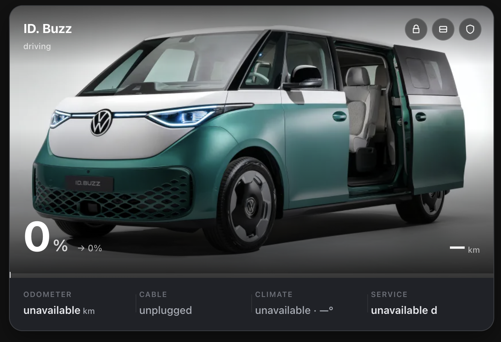
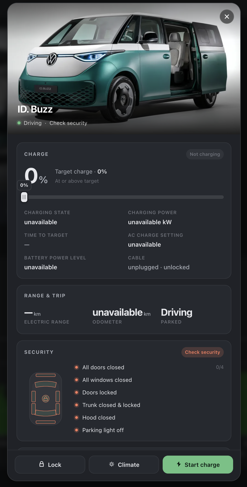

# ha-idbuzz-widget
Home assistant widget to view the state of your VW ID.Buzz and control charging settings.

> [!IMPORTANT]
> VW no longer allows API access for 3rd parties - so this will be broken until [this is fixed](https://github.com/robinostlund/homeassistant-volkswagencarnet/issues/989#issuecomment-5330691845)

## Printscreens

### Main widget

### Popup

